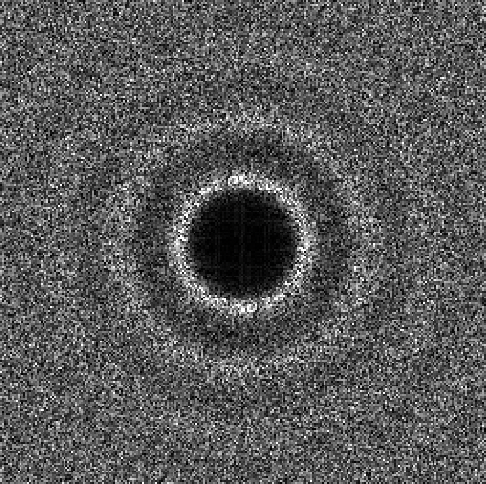

## point sets to power spectra
A tool for visualizing point sets and their frequency power spectra.

### Prerequisites
* Python 3.9.8
* Pytorch 2.1.1
* Assume you have pointset files in `data` folder like this: `data/blue_n1024.txt`; the `.txt` pointset files can be generated using the [utk toolkit](https://github.com/utk-team/utk)


### Run
```bash
python main.py --pointset_name=blue_n1024
```
A `results` folder will be created, with the point set plot as a `.png` file and frequency power spectrum plot as a `.exr` file.

### Results
`blue_n1024` pointset:


`blue_n1024` frequency power spectrum:

